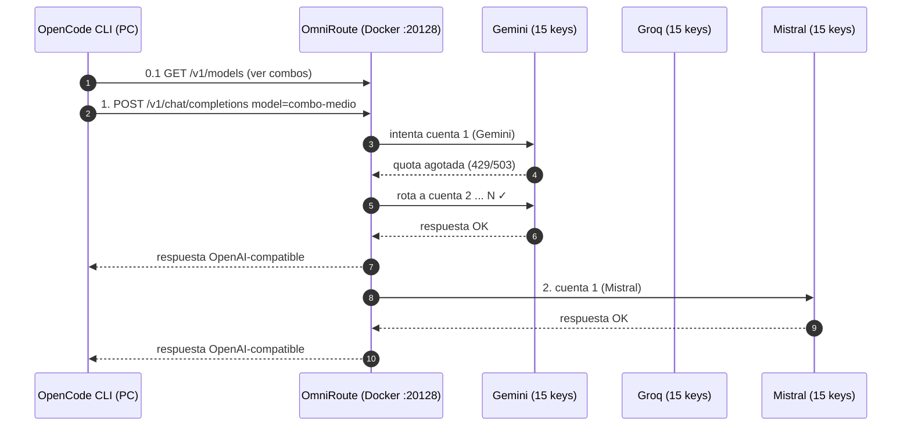
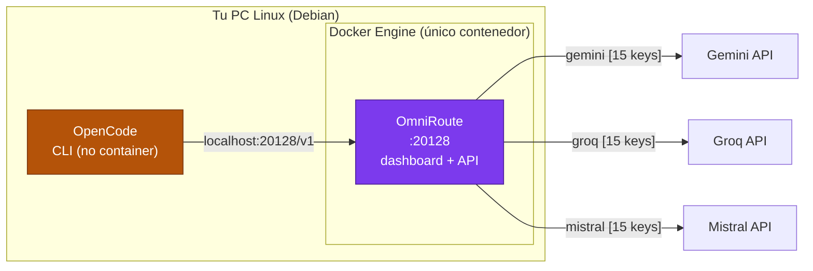

# 🗺️ Arquitectura e Infraestructura

Este documento describe cómo está montado todo el ecosistema, qué corre dónde y por qué.

---

## 🌐 Vista general (un párrafo)

Todo vive en **un solo PC Linux (Debian)**. El **único contenedor Docker** es **OmniRoute** (el gateway que centraliza la IA). **OpenCode** (el asistente CLI) es un **proceso nativo** del sistema operativo. Ambos consumen IA a través de un único punto: la API de OmniRoute en el puerto `20128`.

```
        TU PC LINUX (DEBIAN)
┌─────────────────────────────────────────────────────────────────────┐
│                                                                     │
│  ┌─────────────────────────────┐                                    │
│  │      OMNIRoute (Docker)     │                                    │
│  │   Único contenedor          │                                    │
│  │   Gateway de IA             │                                    │
│  │   Web/API   :20128/v1       │                                    │
│  │                             │                                    │
│  │   • 45 API keys             │                                    │
│  │   • 3 combos                │                                    │
│  │   • rotación automática     │                                    │
│  └───────────┬─────────────────┘                                    │
│              │ 127.0.0.1:20128/v1                                   │
│              ▼                                                     │
│  ┌─────────────────────────────┐   ┌────────────────────────────┐  │
│  │   PROVEEDORES EXTERNOS      │   │      OPENCODE (nativo)     │  │
│  │   (internet)                │   │   CLI · NO es contenedor   │  │
│  │                             │   │                            │  │
│  │   • Gemini      ×15 keys    │   │   Consume MIA via          │  │
│  │   • Groq        ×15 keys    │   │   localhost:20128/v1       │  │
│  │   • Mistral     ×15 keys    │   └────────────────────────────┘  │
│  │                             │                                    │
│  │   Total: 45 keys gratuitas  │                                    │
│  └─────────────────────────────┘                                    │
│                                                                     │
│   LEGENDA DE PUERTOS                                               │
│   ─────────────────┐                                                │
│   :20128  OmniRoute│   (dashboard + API OpenAI-compatible)          │
└─────────────────────────────────────────────────────────────────────┘
```

---

## 📊 Diagrama Mermaid (vista bonita en GitHub)





---

## 🧩 Componentes en detalle

### 1 · OmniRoute (`:20128`) — contenedor
- **Rol:** único punto de entrada de IA. Habla "OpenAI" hacia afuera y traduce hacia Gemini/Groq/Mistral.
- **Aloja:** panel web, providers (las 45 keys), combos, historial, costos.
- **Datos:** volumen Docker `omniroute-data` (tu configuración no se pierde al actualizar).
- **Cambio de modelos:** se hace en la web, sin tocar archivos.

### 2 · OpenCode (CLI) — SIN contenedor
- **Rol:** asistente de código en tu terminal (el programa que estás usando ahora mismo).
- **Depende de:** OmniRoute para la IA → apunta a `localhost:20128/v1`.
- **Nota:** se trata por separado en el **Paso 3** del README principal.

---

## 🔀 Flujo de una petición (ejemplo real)

1. Tú le pides a OpenCode algo difícil.
2. La herramienta manda `POST http://localhost:20128/v1/chat/completions` con `model: combo-medio` (o bajo/avanzado).
3. OmniRoute recibe, identifica el combo por su ID y prueba el **primer modelo** de esa lista.
4. Si la cuenta se agotó → salta al siguiente modelo → siguiente cuenta → siguiente proveedor.
5. Cuando un proveedor devuelve respuesta, OmniRoute la "traduce" al formato OpenAI y se la devuelve.
6. OpenCode recibe la respuesta y sigue trabajando. Todo transparente.

### ⚙️ Configuración práctica actual (agosto 2026)

**Proveedores conectados (5 cuentas por proveedor por ahora):** `gemini`, `groq`, `mistral`.
Al agregar las 10 cuentas restantes (30 keys), cada proveedor llegará a 15 conexiones y la rotación repartirá la carga entre todas.

**Combos creados** (todos con estrategia `priority` y modelos en **AUTO**, que rotan entre cuentas):

| Combo | Modelos (en orden) | Contexto efectivo | Uso |
|---|---|---|---|
| `combo-bajo` | Gemini 3.5 Flash Lite → Mistral Small-2603 → Groq GPT-OSS-20B | 128K | Chat simple, ahorro total |
| `combo-medio` | Gemini 3.6 Flash → Groq GPT-OSS-120B → Mistral Medium-2604 | 128K | Desarrollo diario (default) |
| `combo-avanzado` | Gemini 3.7 Flash → Codestral-2508 → Devstral-2512 → Mistral Large-2512 | 256K | Tareas complejas, agentes, código |

**Compresión de contexto:** activa (master ON). Motores **RTK = Aggressive** + **Caveman = Ultra** apilados. `auto-trigger = 0` (siempre al máximo, sin gatillo extra).

**Rotación:** los 3 combos tienen todos sus modelos en **AUTO** (sin conexión fija), así que OmniRoute reparte entre las cuentas activas de cada proveedor y salta a la siguiente si una falla o se satura. Probado: una cuenta que falla hace que OmniRoute pruebe otra automáticamente.

**Cliente conectado:** OpenCode usa `localhost:20128/v1` (modelo default `combo-medio`). Cualquier otro cliente OpenAI (Cursor, Antigravity, etc.) usa el mismo endpoint.

---

## 🛡️ Subredes y seguridad

| Elemento | Seguridad |
|---|---|
| OmniRoute | Contraseña maestra + `REQUIRE_API_KEY` (opcional pero recomendado) + aislamiento Docker (aquí viven las 45 API keys) |
| API keys | Las 45 keys de los proveedores existen **solo** dentro de OmniRoute (Docker). No están en el PC ni en el repo |
| Exposición | Puertos servidos en `localhost` para uso local. No exponer a internet sin TLS |

---

## 🔄 Ciclo diario de las cuotas (el "truco")

```
Día 1:  cuenta 01.tokens ✈ usados → agotado
        cuenta 02.tokens ✈ usados → agotado
        ...
        cuenta 07.tokens ✈ OK (todavía hay)
Día 2:  cuenta 01.tokens se RENUEVA → vuelve a usar la 01 primero
```

OmniRoute aplica esto solo gracias a la estrategia **`reset-aware`** de los combos y el seguimiento de cuota por conexión. **No necesitas hacer nada manual.**

---

*Diagramas mantenidos en este mismo archivo. Si la arquitectura cambia, actualízalo.*